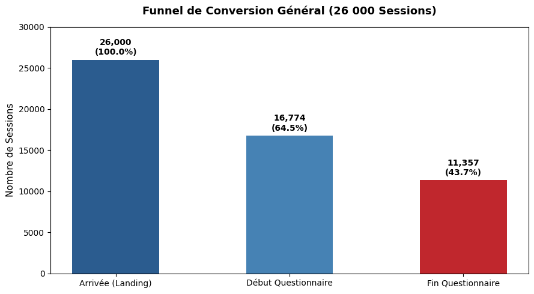
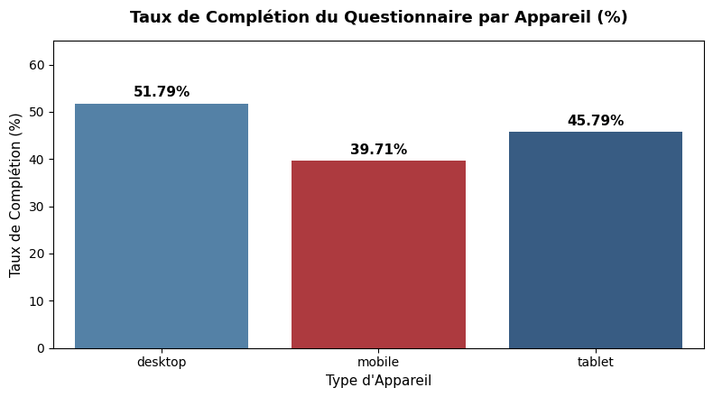
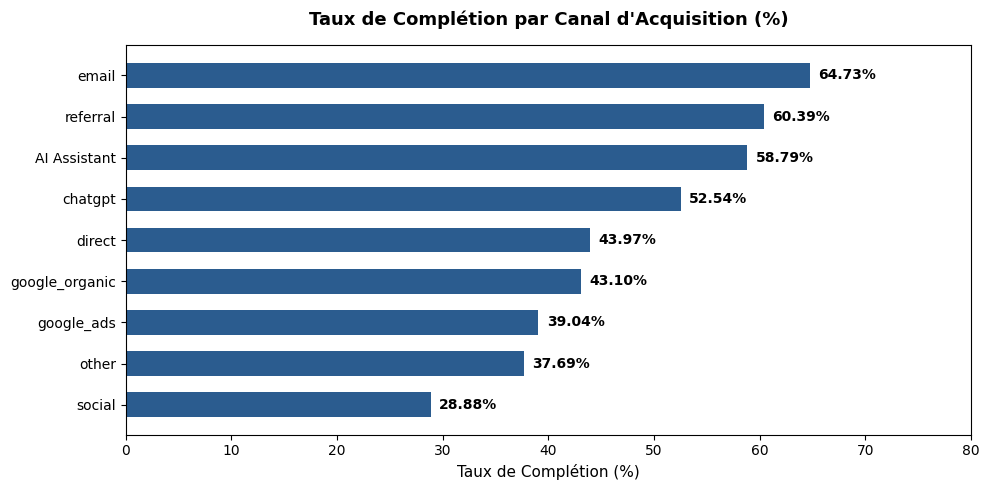

Doctoome — Étude de Cas Technique Data
> **Analyse du Funnel de Conversion & Sensibilisation au Diabète de Type 2**  

---

## Présentation du Projet

Ce projet a pour objectif d'analyser les données de navigation, d'engagement et de résultats cliniques issues du questionnaire de sensibilisation au **diabète de type 2** déployé par **Doctoome**.

L'étude couvre la période de **juin à août 2026** (données synthétiques) à travers un parcours utilisateur en 5 questions menant à trois catégories d'orientation :
- `no_current_indication` : Aucune indication actuelle.
- `possible_risk` : Risque potentiel détecté nécessitant des investigations.
- `declared_diagnosed` : Diagnostic antérieur déjà déclaré par l'utilisateur.

L'objectif central est d'auditer la donnée, d'identifier les goulets d'étranglement du parcours utilisateur, d'évaluer la rentabilité médicale des leviers d'acquisition et de formuler des recommandations stratégiques chiffrées pour les équipes Produit, Data et Marketing.

---

## Architecture du Répertoire

```text
├── data/                               # Données brutes au format Parquet
│   ├── visitors.parquet                # Visiteurs uniques (démographie, région)
│   ├── sessions.parquet                # Sessions de navigation, sources & devices
│   ├── questionnaire_questions.parquet # Référentiel des 5 questions
│   ├── questionnaire_events.parquet    # Télémétrie & événements de parcours (195k lignes)
│   ├── questionnaire_answers.parquet   # Réponses saisies par les utilisateurs
│   └── questionnaire_outcomes.parquet  # Résultats et diagnostics finaux calculés
├── assets/                             # Graphiques et visualisations générées
│   ├── funnel_conversion.png           # Visualisation du funnel de conversion
│   ├── completion_by_device.png        # Comparatif Mobile vs Desktop
│   └── completion_by_channel.png       # Taux de complétion par canal d'acquisition
├── analyse_nour.ipynb                  # Notebook Jupyter principal (Code Python & SQL DuckDB)
├── analyse_nour.md                     # Export Markdown exhaustif de l'analyse
├── requirements.txt                    # Dépendances Python nécessaires à la reproduction
├── CONSIGNE_FR.md                      # Sujet et attentes de l'exercice (FR)
├── CONSIGNE_EN.md                      # Sujet d'origine (EN)
└── README.md                           # Documentation de synthèse du projet
```

---

## Stack Technique Utilisée

- **Langages** : Python 3.10+, SQL (DuckDB in-process)
- **Traitement & Modélisation** : `pandas`, `pyarrow`, `fastparquet`, `duckdb`
- **Data Visualisation** : `matplotlib`, `seaborn`
- **Environnement** : Jupyter Lab / Notebook

---

## Synthèse Méthodologique & Réalisations

Le travail réalisé dans [`analyse_nour.ipynb`](analyse_nour.ipynb) s'articule autour de 8 axes majeurs :

### 1. Audit Qualité & Intégrité des Données (Data Quality)
- **Volumétrie** : 20 000 visiteurs, 26 000 sessions, 195 816 événements, 68 460 réponses, 11 357 questionnaires terminés.
- **Intégrité référentielle** : Validation des correspondances de clés (`visitor_id`, `session_id`, `question_id`).
- **Complétude** : Taux de remplissage démographique très satisfaisant (>96% pour l'âge et le genre).

### 2. Nettoyage & Déduplication Avancée (Data Engineering SQL)
- **Gestion des multi-clics** : 68 460 réponses brutes enregistrées pour 67 763 uniques (utilisateurs modifiant leur réponse ou double-cliquant).
- **Solution SQL mise en place** : Utilisation d'une fonction de fenêtrage (Window Function `ROW_NUMBER()`) sous **DuckDB** pour ne conserver de manière déterministe que la dernière réponse valide (`ORDER BY answered_at DESC`).
- **Standardisation** : Nettoyage des libellés de sources d'acquisition (casse, espaces, typologie de campagnes).

### 3. Analyse du Funnel de Conversion & Frictions
- **Étape 1 — Arrivée (Landing)** : 26 000 sessions (100%).
- **Étape 2 — Démarrage du questionnaire** : 16 774 sessions (**64.5%**).  
   **Point de fuite critique (-35.5%)** : 9 226 visiteurs quittent la page sans interagir.
- **Étape 3 — Parcours des Questions (Q1 à Q5)** : Excellente rétention entre Q1 et Q4 (~95%), puis un **décrochage notable de 13.5% entre Q4 et Q5** (question sur la glycémie/antécédents perçue comme engageante ou technique).
- **Étape 4 — Complétion** : 11 357 questionnaires validés (**43.7% de complétion globale** et **67.7%** parmi ceux qui ont cliqué sur Démarrer).

### 4. Analyse Appareils (Device) : La Friction Mobile
- Le trafic est ultra-majoritairement **Mobile (64.5% des sessions, 16 772 visites)**.
- Cependant, le taux de complétion sur **Mobile n'est que de 39.71%**, contre **51.79% sur Desktop** (soit un **déficit massif de 12.08 points**).
- *Impact direct* : Aligner l'expérience mobile sur le taux desktop générerait **+2 026 questionnaires complétés** supplémentaires sans dépenser un euro de plus en acquisition.

### 5. Canaux d'Acquisition : Volume vs Efficacité Santé
- **Les canaux d'engagement fort** : L'**Emailing (64.7%)** et le **Referral (60.4%)** enregistrent les meilleurs taux de complétion, mais drainent une population globalement saine (~72% `no_current_indication`).
- **Le canal au meilleur ciblage clinique** : **Google Ads (SEA)** affiche un taux de complétion de 39.0%, mais délivre **45.4% de profils à risque ou diagnostiqués** (`possible_risk` + `declared_diagnosed`), soit le double des réseaux sociaux.
- **Le canal sous-performant** : Le **Social (28.9% de complétion)** présente la plus faible efficacité de rétention et le ciblage santé le plus diffus (seulement 23% de profils à risque).

### 6. Validation Épidémiologique
- L'analyse croisée démontre une corrélation forte entre l'âge et le résultat médical :
  - `no_current_indication` : **41.5 ans** d'âge moyen.
  - `possible_risk` : **50.1 ans** d'âge moyen.
  - `declared_diagnosed` : **50.7 ans** d'âge moyen.
- Cette différence de près de **10 ans** valide la cohérence clinique des règles d'attribution du questionnaire.

---

## Visualisations Clés

| Funnel de Conversion Global | Taux de Complétion par Appareil |
|:---:|:---:|
|  |  |

<p align="center">
  <b>Taux de Complétion par Canal d'Acquisition (%)</b><br>
  
</p>

---

## Exemples de Requêtes SQL (DuckDB)

### 1. Déduplication par Window Function
```sql
WITH reponses_triees AS (
    SELECT 
        session_id,
        question_number,
        answer_value,
        answered_at,
        ROW_NUMBER() OVER (
            PARTITION BY session_id, question_number 
            ORDER BY answered_at DESC
        ) AS rn
    FROM answers
)
SELECT 
    question_number,
    COUNT(*) AS total_reponses_propres,
    COUNT(DISTINCT session_id) AS total_sessions
FROM reponses_triees
WHERE rn = 1
GROUP BY question_number
ORDER BY question_number;
```

### 2. Âge Moyen et Cohérence Médicale
```sql
SELECT 
    o.outcome_category,
    COUNT(*) AS total_questionnaires,
    ROUND(AVG(2026 - v.birth_year), 1) AS age_moyen,
    MIN(2026 - v.birth_year) AS age_min,
    MAX(2026 - v.birth_year) AS age_max
FROM visitors v
JOIN outcomes o ON v.visitor_id = o.visitor_id
GROUP BY o.outcome_category
ORDER BY age_moyen DESC;
```

---

## Réponses aux 4 Questions Stratégiques du Sujet

### 1. Quels sont les résultats les plus importants ?
1. **La déperdition majeure se produit sur la Landing Page (35.5% d'abandon immédiat)** : 9 226 utilisateurs partent sans cliquer sur "Démarrer".
2. **Une pénalité UX mobile critique (-12.1 points)** : Le mobile concentre 64.5% du trafic mais sous-performe nettement (39.71% vs 51.79% sur Desktop). Combler ce gap rapporterait plus de 2 000 questionnaires complétés.
3. **Le paradoxe des canaux d'acquisition** : L'email convertit le mieux en volume, mais **Google Ads est le canal le plus performant pour la mission médicale** de Doctoome (45.4% de profils à risque détectés contre 23.0% pour le Social).
4. **Cohérence médicale avérée** : Les profils à risque sont nettement plus âgés (+8.6 à +9.2 ans), confirmant que l'algorithme discrimine fidèlement la population cible.

### 2. Quelles questions restent sans réponse ?
1. **Le motif du décrochage à la Question 5** : Pourquoi 13.5% des utilisateurs qui ont déjà répondu à 4 questions abandonnent-ils au dernier moment ? (Terminologie anxiogène, question perçue comme intrusive, ou bug technique ?).
2. **Le Coût d'Acquisition Client (CAC) et le ROI financier** : En l'absence des données de dépenses marketing (`ad_spend`), impossible de calculer le coût réel par profil à risque détecté.
3. **La nature exacte de la friction mobile** : Est-ce un temps de chargement trop long (Web Vitals), un élément non responsive ou une ergonomie de saisie inadaptée au tactile ?
4. **La conversion post-questionnaire** : Que font les 2 276 utilisateurs classés `possible_risk` après avoir reçu leur résultat ? Consultent-ils un médecin sur Doctoome ?

### 3. Quelles données supplémentaires collecteriez-vous ?
1. **Télémétrie UX granulaire** : Mesure du temps passé par question (`time_spent_per_step`), suivi des erreurs JavaScript frontend et taux de défilement (scroll depth).
2. **Conversion aval (Business Doctoome)** : Tracking des clics sur les boutons d'orientation finale (*"Prendre RDV avec un médecin"*), identifiants de réservation (`booking_id`) et consultation effective.
3. **Données marketing enrichies** : Coûts par clic (CPC), budgets de campagnes et mots-clés de recherche Google Ads.
4. **Opt-in de suivi** : Collecte d'un consentement de rappel pour relancer par email ou SMS les profils à risque n'ayant pas pris rendez-vous sous 15 jours.

### 4. Que recommanderiez-vous de suivre si le questionnaire restait actif pendant 12 mois ?
1. **Dashboard Opérationnel & Alertes Temps Réel** : Suivi hebdomadaire du taux de rebond landing, du taux de complétion par device/source, et mise en place d'alertes automatiques (Slack/Email) en cas de baisse anormale de conversion.
2. **Monitoring du Data Drift & Saisonnalité** : Surveillance de la dérive des distributions d'âge et de région au fil des mois, et anticipation des pics saisonniers (ex. Journée Mondiale du Diabète en novembre).
3. **Programme d'A/B Testing Continu** :
   - *Test A/B Landing* : Afficher directement la Question 1 sur la page d'accueil pour supprimer l'étape de transition intermédiaire.
   - *Test A/B UX Mobile* : Tester une ergonomie de type "carte swipeable" simplifiée pour résorber l'écart avec le desktop.
4. **KPI Métier d'Impact Santé & Rentabilité** :
   $$\text{Coût par Patient à Risque Orienté} = \frac{\text{Budget Marketing Mensuel}}{\text{Nombre de RDV Doctoome Pris par des Profils à Risque}}$$

---

## Instructions de Reproduction

### Prérequis
- Python 3.10 ou supérieur
- Gestionnaire de paquets `pip`

### Installation
```bash
# 1. Cloner le dépôt
git clone https://github.com/Nawara2412/Analyse_nour.git
cd Analyse_nour

# 2. Créer et activer un environnement virtuel
python -m venv .venv
# Sur Windows :
.venv\Scripts\activate
# Sur macOS / Linux :
source .venv/bin/activate

# 3. Installer les dépendances
pip install -r requirements.txt

# 4. Lancer Jupyter Lab / Notebook
jupyter lab
```
Ouvrez ensuite le notebook [`analyse_nour.ipynb`](analyse_nour.ipynb) et exécutez toutes les cellules pour reproduire l'intégralité des analyses et visualisations.
